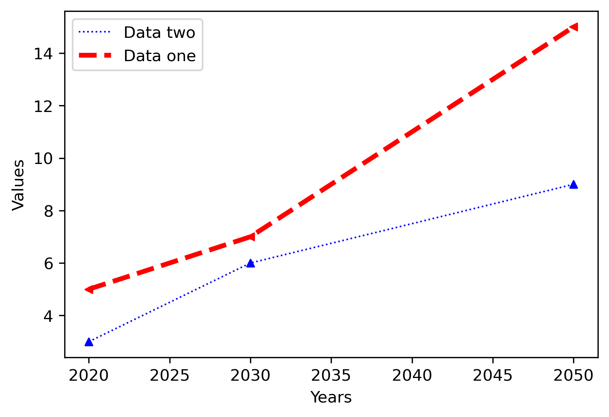
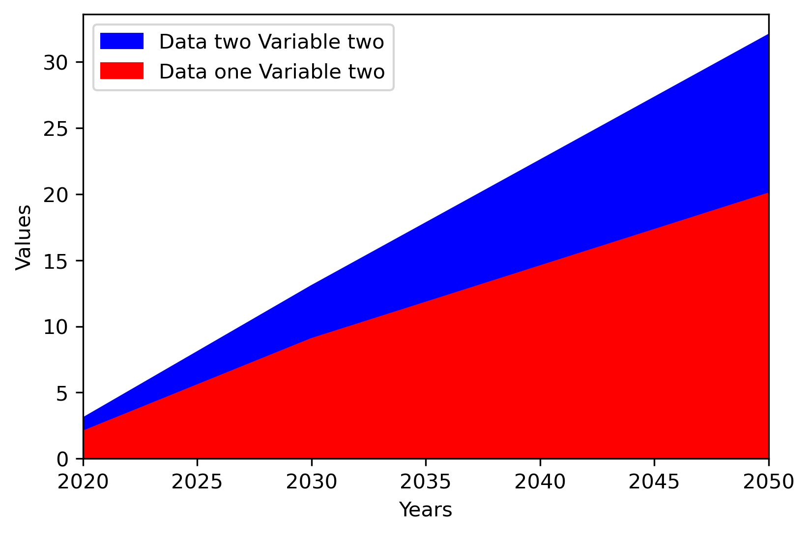
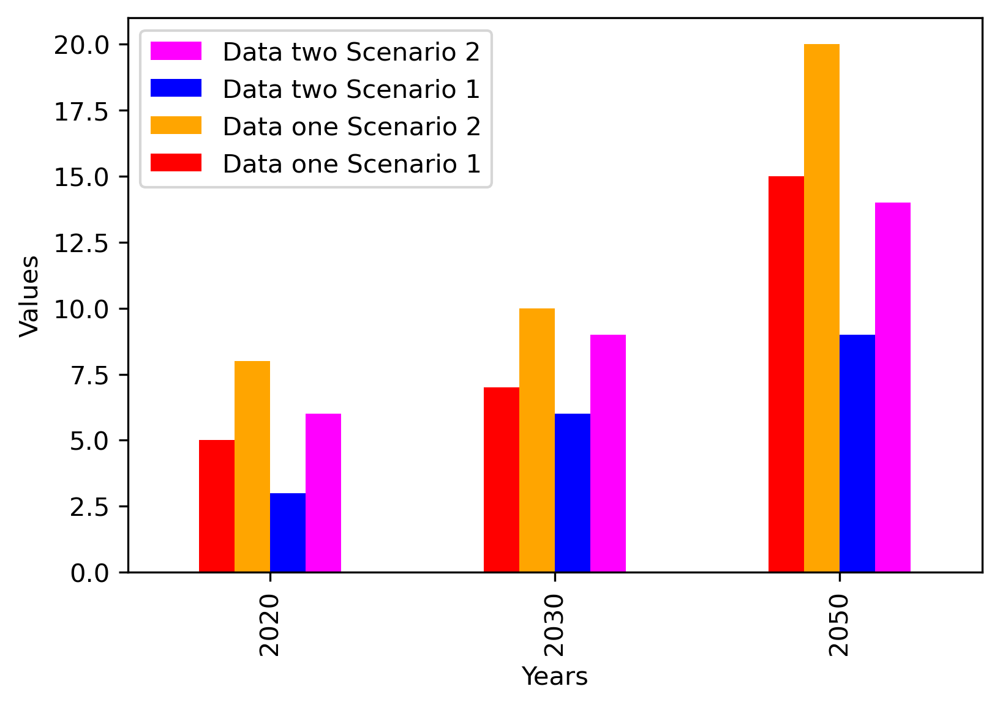
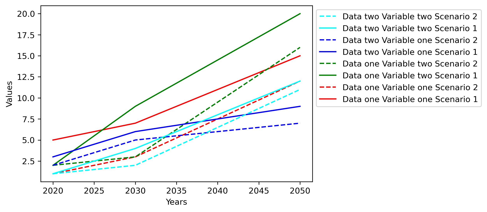
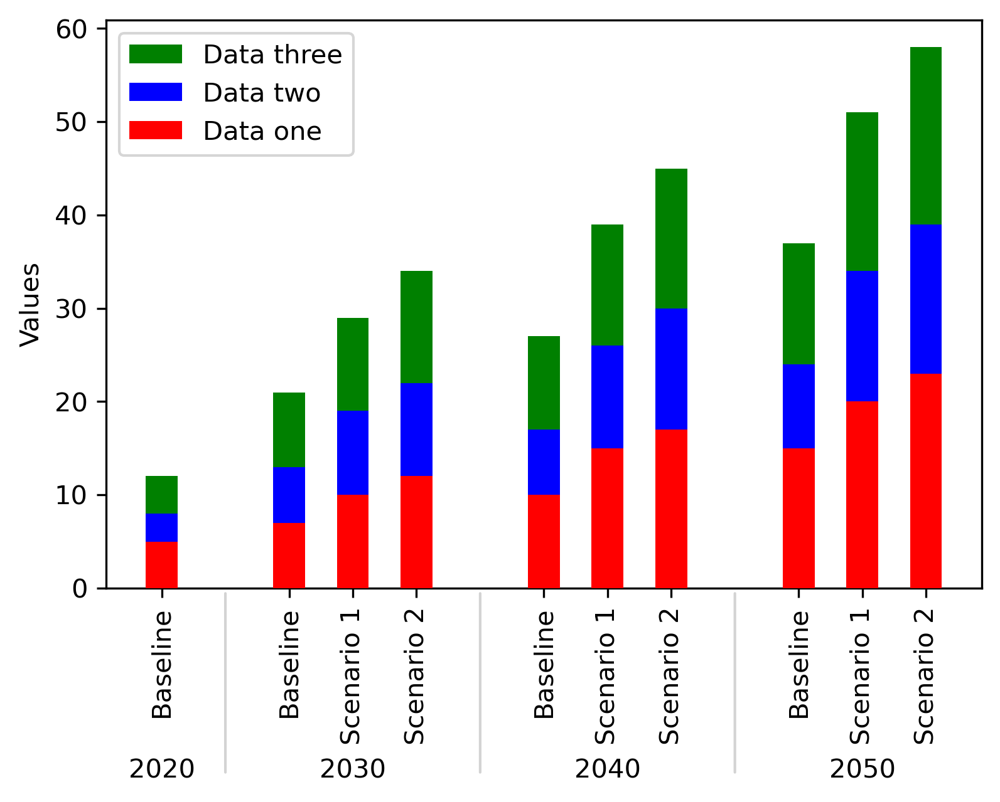

# Customizable Semi-Automatic Graphs in Python (CSAG py)

This Python code generates detailed and customizable graphs based on data stored in a [Pandas DataFrame](https://pandas.pydata.org/docs/index.html). It's designed primarily for analyzing GAMS Data eXchange (GDX) files, but it can handle any labeled data that can be transcribed into a DataFrame.

If not utilizing GDX files, the sections **Installation of GAMS API** and **Usage with GDX files** can be skipped to proceed directly to **Plotting a Graph**.

## Installation of GAMS API

To install the GAMS API, follow these steps:

1. **Verify Conda Installation**:
   - Check the accessibility of Conda from the terminal by examining its version:
     ```
     $ conda --version
     ```
     It should display `conda xx.y.z`, where `xx.y.z` represents the Conda version.

2. **Create a New Conda Environment**:
   - Create an isolated Python environment named "gams":
     ```
     $ conda create --name gams python=3.10
     ```
   - Activate the environment:
     ```
     $ conda activate gams
     ```

3. **Install the GAMS API**:
   
   Install the GAMS Python API using pip, specifically the *transfer* module:
     ```
     (gams)$  pip install gamsapi[transfer]==xx.y.z
     ```
     Here, `xx.y.z` denotes the installed GAMS version number (e.g., 46.4.1).

If encountering issues during this installation, the [official GAMS API documentation](https://www.gams.com/latest/docs/API_PY_GETTING_STARTED.html) provides a comprehensive guide.

## Usage with GDX files

For effective utilization of GDX files, follow these steps:

1. **Load GDX file into Container object**:
   
```python
from gams import GamsWorkspace
import gams.transfer as gt

gams_system_directory = 'gams_system_directory'  # Define the GAMS system directory
ws = GamsWorkspace(system_directory=gams_system_directory) # Create a GamsWorkspace object

path_to_gdx_file = 'path_to_gdx\gdxfile.gdx'
data_container = gt.Container(load_from=path_to_gdx_file, system_directory=ws.system_directory)
gdx_description, gdx_dict = functions.data_description(data_container)  # Gives a summary of the data available
```

The GDX file is stored as a Container object, encapsulating all aliases, parameters, equations, variables, and sets under a label detailed in the `gdx_dict` dictionary (acronym and meaning, if provided in the GAMS code). Additionally, a summary of all this data is available in `gdx_description`, providing name, type, domain, domain type, dimension, number of records, sparsity, and various characteristics of the levels and values.

2. **Verification of the Container object (Optional)**

If not familiar with the data being worked with or unsure of how to spell specific names, the verification function can be used. Once the label of the data for analysis is identified, this function helps to specify the desired data subset.

```python
functions.verification(gdx_files, name, x_var, y_var, years_to_compare, data_to_compare)
```

The `functions.verification` checks if the specified `x_var`, `y_var`, `years_to_compare`, and `data_to_compare` exist in the DataFrame labeled `name` in the Container object(s) from the `gdx_files` list. It returns a list of the DataFrames if no error occurs (if all the specified elements exist in the DataFrame). Otherwise, it displays a customized message to help identify the mistake. The `functions.verification` can also check for additional variables called `z_var` and `z_var_to_compare`.

To effectively use this function, the following line of code would be appropriate as it will assign the list of DataFrames to `dataframes` if there's no error encountered.

~~~py
if dataframes := functions.verification(gdx_files, name, x_var, y_var, years_to_compare, data_to_compare):
    fig, ax = plt.subplots()
    df = functions. ...
~~~

## Plotting a Graph

To plot a graph, ensure that the DataFrame is formatted as shown below:

| Index    | Column name 1 | Column name 2    | ... | Column name n | value or level|
|----------|---------------|------------------|-----|---------------|----------------|
| 1        | Row name 1.1  | Row name 2.1     | ... | Row name n.1  | Number         |
| 2        | Row name 1.2  | Row name 2.1     | ... | Row name n.1  | Number         |
| ...      | ....          | ...              | ... | ...           | ...            |
| a * b * c | Row name 1.a | Row name 2.b     | ... | Row name n.c  | Number         |

Ensure that the Column names are distinct, as well as the Row names within the same column. The column containing the values to plot should be named either "value" or "level". If analyzing a GDX file, the format should already be appropriate.

###  Required Variables

Once you have a correctly formatted DataFrame, specify the columns and rows to plot using the following variables:

   - `x_var`: Label of the data in the DataFrame for the x-axis. Typically, this represents different years for comparison.
   - `y_var`: Label of the data in the DataFrame for the y-axis of the graph.
   - `years_to_compare`: Specific data in the column `x_var` you want to plot (usually years).
   - `data_to_compare`: Specific data in the column `y_var` you want to plot.
   - `data_label_dict`: Names of the data on the y-axis to be shown in the legend.
   - `color_dict`: Colors assigned to each data series plotted.

Examples of the different types of graphs that can be plotted are provided below.

### Plotting a two variables line, area or bar graph



As a first example, consider the following DataFrame with two columns:

| Index | Column 1 | Column 2 | value |
|-------|----------|----------|-------|
| 1     | 2020     | Data1    | 5  |
| 2     | 2030     | Data1    | 7  |
| 3     | 2040     | Data1    | 10 |
| 4     | 2050     | Data1    | 15 |
| 5     | 2020     | Data2    | 3  |
| 6     | 2030     | Data2    | 6  |
| 7     | 2040     | Data2    | 7  |
| 8     | 2050     | Data2    | 9  |
| 9     | 2020     | Data3    | 4  |
| 10    | 2030     | Data3    | 8  |
| 11    | 2040     | Data3    | 10 |
| 12    | 2050     | Data3    | 13 |

To plot this DataFrame, `functions.graph_2_variables` can be used:


~~~py
import matplotlib.pyplot as plt
import functions
import pandas as pd

# Create the DataFrame
data = {
    'Column 1': [2020, 2030, 2040, 2050, 2020, 2030, 2040, 2050, 2020, 2030, 2040, 2050],
    'Column 2': ['Data1', 'Data1', 'Data1', 'Data1', 'Data2', 'Data2', 'Data2', 'Data2', 'Data3', 'Data3', 'Data3', 'Data3'],
    'value': [5, 7, 10, 15, 3, 6, 7, 9, 4, 8, 10, 13]}
df = pd.DataFrame(data)

x_var = 'Column 1'
y_var = 'Column 2'
years_to_compare = [2020, 2030, 2050] # Filter out 2040
data_to_compare = ['Data1', 'Data2'] # Filter out Data3
data_label_dict = {'Data1': 'Data one', 'Data2': 'Data two'}
color_dict = {'Data1': 'red', 'Data2': 'blue'}

marker_dict = {'Data1': '<', 'Data2': '^'}  # Optional argument
linestyle_dict = {'Data1': '--', 'Data1': ':'}  # Optional argument
linewidth_dict = {'Data1': 5, 'Data2': 1}  # Optional argument

kind = 'line'  # Either line, area or bar

fig, ax = plt.subplots()
df = functions.graph_2_variables(kind, ax, df, x_var, y_var, years_to_compare, data_to_compare,
                                 data_label_dict, color_dict, marker_dict=marker_dict, 
                                 linestyle=linestyle_dict, linewidth=linewidth_dict)
~~~

The two variable graph function can also accept marker, linestyle, and linewidth dictionaries as arguments if needed. The syntax is the same as for the `color_dict`.

### Plotting a three variables line, area or bar graph



For the second example, consider the following DataFrame with three columns:

| Index | Column 1 | Column 2 | Column 3  | value |
|-------|----------|----------|-----------|-------|
| 1     | 2020     | Data1    | Variable1 | 5  |
| 2     | 2030     | Data1    | Variable1 | 7  |
| 3     | 2040     | Data1    | Variable1 | 10 |
| 4     | 2050     | Data1    | Variable1 | 15 |
| 5     | 2020     | Data2    | Variable1 | 3  |
| 6     | 2030     | Data2    | Variable1 | 6  |
| 7     | 2040     | Data2    | Variable1 | 7  |
| 8     | 2050     | Data2    | Variable1 | 9  |
| 9     | 2020     | Data3    | Variable1 | 4  |
| 10    | 2030     | Data3    | Variable1 | 8  |
| 11    | 2040     | Data3    | Variable1 | 10 |
| 12    | 2050     | Data3    | Variable1 | 13 |
| 13    | 2020     | Data1    | Variable2 | 2  |
| 14    | 2030     | Data1    | Variable2 | 9  |
| 15    | 2040     | Data1    | Variable2 | 17 |
| 16    | 2050     | Data1    | Variable2 | 20 |
| 17    | 2020     | Data2    | Variable2 | 1  |
| 18    | 2030     | Data2    | Variable2 | 4  |
| 19    | 2040     | Data2    | Variable2 | 7  |
| 20    | 2050     | Data2    | Variable2 | 12 |
| 21    | 2020     | Data3    | Variable2 | 6  |
| 22    | 2030     | Data3    | Variable2 | 8  |
| 23    | 2040     | Data3    | Variable2 | 13 |
| 24    | 2050     | Data3    | Variable2 | 16 |

To plot this DataFrame, `functions.graph_3_variables` can be used:

~~~py
data = {
    'Column 1': [2020, 2030, 2040, 2050] * 6,
    'Column 2': ['Data1', 'Data1', 'Data1', 'Data1', 'Data2', 'Data2', 'Data2', 'Data2', 'Data3', 'Data3', 'Data3', 'Data3'] * 2,
    'Column 3': ['Variable1'] * 12 + ['Variable2'] * 12,
    'value': [5, 7, 10, 15, 3, 6, 7, 9, 4, 8, 10, 13, 2, 9, 17, 20, 1, 4, 7, 12, 6, 8, 13, 16]}
df = pd.DataFrame(data)

x_var = 'Column 1'
y_var = 'Column 2'
z_var = 'Column 3'

years_to_compare = [2020, 2030, 2050]  # Filter out 2040
y_var_to_compare = ['Data1', 'Data2']  # Filter out Data3
z_var_to_compare = ['Variable2']  # Filter out Variable1

y_var_label_dict =  {'Data1': 'Data one', 'Data2': 'Data two'}
z_var_label_dict = {'Variable2':'Variable two'}

color_dict = {('Data1','Variable2'): 'red', ('Data2','Variable2'): 'blue'}

kind = 'area'

fig, ax = plt.subplots()

df = functions.graph_3_variables(kind, ax, df, x_var, y_var, z_var,
                                 years_to_compare, y_var_to_compare, z_var_to_compare,
                                 y_var_label_dict, color_dict, z_var_label_dict)
~~~

Here, with three variables to analyze, the names of the analyzed data are referred to as `y_var_to_compare` and `z_var_to_compare`. The structure of the dictionnaries will also be different from the previous examples. In the `color_dict`, we will need to have every possible combination of `y_var_to_compare` and `z_var_to_compare`.

This example showcases an area graph, so it isn't possible to customize the marker, linestyle, or linewidth.


### Plotting a multiple scenario two variables line or bar graph



This example will utilize the same DataFrame as in the **Plotting a two variables line, area, or bar graph** example. Additionally, it will incorporate another DataFrame with slightly modified values to simulate a different scenario:.

To plot these DataFrames, `functions.graph_mulitple_scenarios_2_variables` can be used:

~~~py
data1 = {
    'Column 1': [2020, 2030, 2040, 2050, 2020, 2030, 2040, 2050, 2020, 2030, 2040, 2050],
    'Column 2': ['Data1', 'Data1', 'Data1', 'Data1', 'Data2', 'Data2', 'Data2', 'Data2', 'Data3', 'Data3', 'Data3', 'Data3'],
    'value': [5, 7, 10, 15, 3, 6, 7, 9, 4, 8, 10, 13]}
df1 = pd.DataFrame(data1)

data2 = {
    'Column 1': [2020, 2030, 2040, 2050, 2020, 2030, 2040, 2050, 2020, 2030, 2040, 2050],
    'Column 2': ['Data1', 'Data1', 'Data1', 'Data1', 'Data2', 'Data2', 'Data2', 'Data2', 'Data3', 'Data3', 'Data3', 'Data3'],
    'value': [8, 10, 15, 20, 6, 9, 11, 14, 7, 10, 13, 17]}
df2 = pd.DataFrame(data2)
dataframes = [df1, df2]

x_var = 'Column 1'
y_var = 'Column 2'
years_to_compare = [2020, 2030, 2050]  # Filter out 2040
data_to_compare = ['Data1', 'Data2']  # Filter out Data3
data_label_dict = {'Data1': 'Data one', 'Data2': 'Data two'}
scenario_names = ['Scenario 1', 'Scenario 2']

color_dict = {('Data1','Scenario 1'): 'red', ('Data2','Scenario 1'): 'blue',
              ('Data1','Scenario 2'): 'orange', ('Data2','Scenario 2'): 'magenta'}

kind = 'bar'  # Either line or bar

fig, ax = plt.subplots()
df = functions.graph_mulitple_scenarios_2_variables(kind, ax, dataframes, x_var, y_var,
                                                    years_to_compare, data_to_compare,
                                                    data_label_dict, color_dict, scenario_names)
~~~

Since comparing multiple DataFrames (considered as different scenarios), they need to be named with `scenario_names`. Additionally, the `color_dict` must consider the name of these scenarios. Here's an example for a bar graph (also works with barh). An area graph wouldn't be appropriate for comparing multiple scenarios.

### Plotting a multiple scenario three variables line or bar graph



This example will use the DataFrame from **Plotting a three variables line, area, or bar graph** and another one with modified values to simulate a comparison of multiple scenarios.

To plot these DataFrames, `functions.graph_mulitple_scenarios_3_variables` can be used:

~~~py
data1 = {
    'Column 1': [2020, 2030, 2040, 2050] * 6,
    'Column 2': ['Data1', 'Data1', 'Data1', 'Data1', 'Data2', 'Data2', 'Data2', 'Data2', 'Data3', 'Data3', 'Data3', 'Data3'] * 2,
    'Column 3': ['Variable1'] * 12 + ['Variable2'] * 12,
    'value': [5, 7, 10, 15, 3, 6, 7, 9, 4, 8, 10, 13, 2, 9, 17, 20, 1, 4, 7, 12, 6, 8, 13, 16]}
df1 = pd.DataFrame(data1)

data2 = {
    'Column 1': [2020, 2030, 2040, 2050] * 6,
    'Column 2': ['Data1', 'Data1', 'Data1', 'Data1', 'Data2', 'Data2', 'Data2', 'Data2', 'Data3', 'Data3', 'Data3', 'Data3'] * 2,
    'Column 3': ['Variable1'] * 12 + ['Variable2'] * 12,
    'value': [1, 3, 7, 12, 2, 5, 6, 7, 2, 6, 9, 11, 2, 3, 15, 16, 1, 2, 6, 11, 1, 7, 10, 15]}
df2 = pd.DataFrame(data2)

dataframes = [df1, df2]

x_var = 'Column 1'
y_var = 'Column 2'
z_var = 'Column 3'

years_to_compare = [2020, 2030, 2050]  # Filter out 2040
y_var_to_compare = ['Data1', 'Data2']  # Filter out Data3
z_var_to_compare = ['Variable1','Variable2']

y_var_label_dict =  {'Data1': 'Data one', 'Data2': 'Data two'}
z_var_label_dict = {'Variable1':'Variable one', 'Variable2':'Variable two'}

scenario_names = ['Scenario 1', 'Scenario 2']

color_dict = {('Data1','Variable1','Scenario 1'): 'red', ('Data2','Variable1','Scenario 1'): 'blue',
              ('Data1','Variable1','Scenario 2'): 'red', ('Data2','Variable1','Scenario 2'): 'blue',
              ('Data1','Variable2','Scenario 1'): 'green', ('Data2','Variable2','Scenario 1'): 'cyan',
              ('Data1','Variable2','Scenario 2'): 'green', ('Data2','Variable2','Scenario 2'): 'cyan'
              }

linestyle_dict = {('Data1','Variable1','Scenario 1'): '-', ('Data2','Variable1','Scenario 1'): '-',
              ('Data1','Variable1','Scenario 2'): '--', ('Data2','Variable1','Scenario 2'): '--',
              ('Data1','Variable2','Scenario 1'): '-', ('Data2','Variable2','Scenario 1'): '-',
              ('Data1','Variable2','Scenario 2'): '--', ('Data2','Variable2','Scenario 2'): '--'
              }

kind = 'line'

legend_position = (1,1)
fig, ax = plt.subplots()
df = functions.graph_mulitple_scenarios_3_variables(kind, ax, dataframes, x_var, y_var, z_var,
                                                    years_to_compare, y_var_to_compare, z_var_to_compare
                                                    y_var_label_dict, color_dict, z_var_label_dict,
                                                    scenario_names, linestyle = linestyle_dict)
~~~

Here, the option to specify the legend location is also showcased.

### Plotting a stacked grouped graph



To plot a stacked grouped graph, multiple scenarios are needed to compare over multiple years for multiple data. The DataFrames for this example are the same as from **Plotting a three variables line, area, or bar graph** with slightly different values to simulate different scenarios.

~~~py
data1 = {
    'Column 1': [2020, 2030, 2040, 2050, 2020, 2030, 2040, 2050, 2020, 2030, 2040, 2050],
    'Column 2': ['Data1', 'Data1', 'Data1', 'Data1', 'Data2', 'Data2', 'Data2', 'Data2', 'Data3', 'Data3', 'Data3', 'Data3'],
    'value': [5, 7, 10, 15, 3, 6, 7, 9, 4, 8, 10, 13]}
df1 = pd.DataFrame(data1)

data2 = {
    'Column 1': [2020, 2030, 2040, 2050, 2020, 2030, 2040, 2050, 2020, 2030, 2040, 2050],
    'Column 2': ['Data1', 'Data1', 'Data1', 'Data1', 'Data2', 'Data2', 'Data2', 'Data2', 'Data3', 'Data3', 'Data3', 'Data3'],
    'value': [8, 10, 15, 20, 6, 9, 11, 14, 7, 10, 13, 17]}
df2 = pd.DataFrame(data2)
data3 = {
    'Column 1': [2020, 2030, 2040, 2050, 2020, 2030, 2040, 2050, 2020, 2030, 2040, 2050],
    'Column 2': ['Data1', 'Data1', 'Data1', 'Data1', 'Data2', 'Data2', 'Data2', 'Data2', 'Data3', 'Data3', 'Data3', 'Data3'],
    'value': [10, 12, 17, 23, 8, 10, 13, 16, 9, 12, 15, 19]}
df3 = pd.DataFrame(data3)
dataframes = [df1, df2, df3]

x_var = 'Column 1'
y_var = 'Column 2'

years_to_compare = [2020, 2030, 2040, 2050]
data_to_compare = ['Data1', 'Data2', 'Data3']

data_label_dict =  {'Data1': 'Data one', 'Data2': 'Data two', 'Data3':'Data three'}
color_dict = {'Data1': 'red', 'Data2': 'blue', 'Data3':'green'}

scenario_names = ['Baseline', 'Scenario 1', 'Scenario 2']
baseline_year = 2020  # Name and year of the baseline
baseline_name = 'Baseline'

fig, ax = plt.subplots()
df = functions.stacked_bar_graph(ax, dataframes, x_var, y_var,
                                 years_to_compare, data_to_compare,
                                 data_label_dict, color_dict,
                                 scenario_names, baseline_year,
                                 baseline_name)
~~~

The `color_dict` for this function differs from the others, as you only need to specify the color for each data, which will be repeated in all the scenarios over the years. Additionally, you have to specify the `baseline_year` and the `baseline_name` so that there is only one bar for the year of reference.

### Adjust other customization

Since the `ax` object is created outside the functions, it can be accessed to add specific titles to the axis, remove margins, add a grid, etc. Here are some examples:

~~~py
ax.grid(axis='y')
ax.set_ylabel('')
ax.set_title('')
ax.margins(0)
~~~


